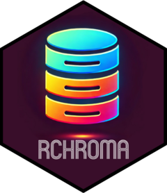

# rchroma <a href="https://cynkra.github.io/rchroma/"></a>

<!-- badges: start -->

[](https://github.com/cynkra/rchroma/actions/workflows/R-CMD-check.yaml)
[](https://app.codecov.io/gh/cynkra/rchroma?branch=main)
<!-- badges: end -->

rchroma provides a clean interface to
[ChromaDB](https://www.trychroma.com/), a modern vector database for
storing and querying embeddings.

## Installation

You can isntall rchroma from CRAN:

``` r
install.packages("rchroma")
```

Or you can install the developer version from GitHub:

``` r
# install.packages("remotes")
remotes::install_github("cynkra/rchroma")
```

You also need a running ChromaDB instance. The easiest way to get
started is using the provided Docker helper functions:

``` r
chroma_docker_run()
# use chroma_docker_stop() to stop the container
```

See the [ChromaDB
documentation](https://docs.trychroma.com/docs/overview/introduction)
for other installation methods.

## Usage

``` r
library(rchroma)

# Connect to ChromaDB
client <- chroma_connect()

# Create a collection and add documents with embeddings
create_collection(client, "my_collection")
add_documents(
  client,
  "my_collection",
  documents = c("apple", "banana"),
  ids = c("doc1", "doc2"),
  embeddings = list(
    c(1.0, 0.0), # apple
    c(0.8, 0.2) # banana (similar to apple)
  )
)

# Query similar documents using embeddings
query(
  client,
  "my_collection",
  query_embeddings = list(c(1.0, 0.0)), # should match apple best
  n_results = 2
)
```
